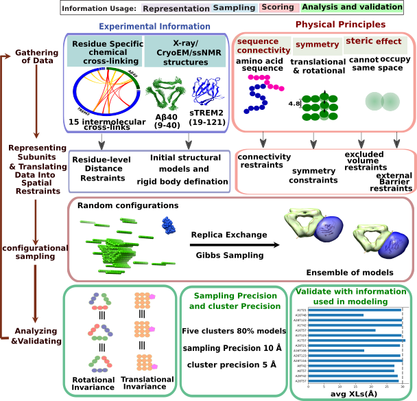

# Integrative Structure Determination of Aβ40-TREM2 complex

## Summary
Triggering receptor expressed on myeloid cells 2 (TREM2) is a transmembrane receptor that is secreted in a soluble (sTREM2) form. Mutations in TREM2, especially R47H, has been linked to increase the risk of Alzheimer’s disease (AD). A prominent neuropathological component of AD is deposition of the amyloid-beta (Aβ) into plaques, particularly Aβ40 and Aβ42. While the membrane-bound form of TREM2 is known to facilitate uptake of Aβ fibrils and the polarization of microglial processes toward amyloid plaques, the role of its soluble ectodomain in interactions with fibrillar Aβ, has been less clear. We generated the structure of the WT sTREM2-Aβ40 fibril complex using integrative molecular modeling based primarily on the crosslinking mass spectrometry data to understand the probable interaction surfaces of sTREM2 and Aβ40 fibril. Our modeling shows that sTREM2 binds the fibrils along one face of the structure, leaving a second, mutation-sensitive site free to mediate cellular binding and uptake. 
These scripts demonstrate the use of [IMP](http://salilab.org/imp) in the modeling of the fibrillar Aβ40-TREM2 complex using crosslinking dataset. 
The scripts work with the [IMP](http://salilab.org/imp) (Release 2.8.0 and newer).

## List of files and directories:

- `data`   	 contains all relevant information for the modeling: XL-MS dataset, FASTA file and atomic coordinates of TREM2 and Abeta40 fibril.
- `modeling_scripts`	 contains all the modeling and analysis scripts to generate the ensemble of solutions and analyze them. 
- `analysis_scripts`	 contains all analysis scripts which should be used to process all sampling outputs.
- `results`	 contains all relevent results discussed in the published paper.

## Integrative modeling approach summary for this project

## Information

_Author(s)_: Dibyendu Mondal

_License_: [CC BY-SA 4.0](https://creativecommons.org/licenses/by-sa/4.0/) This work is licensed under the Creative Commons Attribution-ShareAlike 4.0 International License.

_Last known good IMP version_: 

_Publications_:
Soluble TREM2 inhibits secondary nucleation of Aβ fibrillization and enhances cellular uptake of fibrillar Aβ.
Ketaki D. Belsare#, Haifan Wu#, Dibyendu Mondal#, Annalise Bond, Jia Jin, Hyunil Jo, Addison E. Roush, Kala Bharath Pilla, Andrej Sali*, Carlo Condello*, and William DeGrado*
Proceedings of the National Academy of Sciences DOI:10.1073/pnas.2114486119.  

