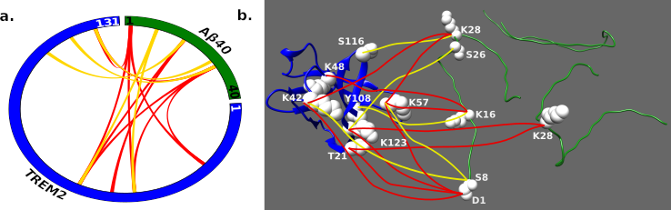

# Representation and data used for the integrative structure determination of the Aβ40-TREM2 complex.

Master data directory; used by all modeling scripts to generate the ensemble of solutions of the complex.

## List of files and directories:

`data` contains all relevant data
## Sequence and structures files
- `TREM2_ABfibril.fasta` contains all the sequences of the Aβ40-TREM2 complex.
- `2LMP_D_J_P.pdb` is the pdb representing a basic three chains unit of Aβ40 monomer; it is taken from the solid state NMR structure of the Aβ40 [PDB 2LMP](https://www.rcsb.org/structure/2LMP); [article](https://www.pnas.org/content/105/47/18349)
- `TREM2_A.pdb` is the crystal structure of human TREM2 (Ig domain) (see [PDB 5UD7](https://www.rcsb.org/structure/5UD7); [article](https://www.sciencedirect.com/science/article/pii/S0021925820313806?via%3Dihub).

## Cross-linking datasets
- `bs3_nshsf_mixed.csv` : Total 15 intermolecular (BS3 and NSHSF) cross-links for the complex

### Summary of the cross-linking dataset

## Information

_Author(s)_: Dibyendu Mondal

_License_: [LGPL](http://www.gnu.org/licenses/old-licenses/lgpl-2.1.html).
This library is free software; you can redistribute it and/or
modify it under the terms of the GNU Lesser General Public
License as published by the Free Software Foundation; either
version 2 of the License, or (at your option) any later version.

_Publications_:
Soluble TREM2 inhibits secondary nucleation of Aβ fibrillization and enhances cellular uptake of fibrillar Aβ.
Ketaki D. Belsare#, Haifan Wu#, Dibyendu Mondal#, Annalise Bond, Jia Jin, Hyunil Jo, Addison E. Roush, Kala Bharath Pilla, Andrej Sali*, Carlo Condello*, and William DeGrado*
Proceedings of the National Academy of Sciences DOI:10.1073/pnas.2114486119.  
