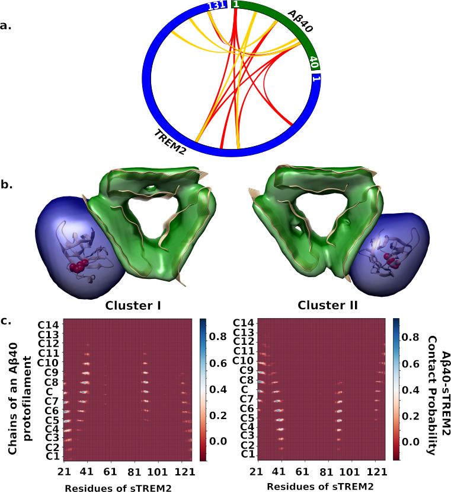

#Results for the integrative structure determination of Aβ40-sTREM2 complex.

Directory for the main results of the modeling pipelines for determining structure of Aβ40-sTREM2 complex that follows the four stages of integrative modeling. (see README.md in parent directory)

## List of files and directories:

`results` directory contains all results reported for the structures Aβ40-sTREM2 complex.

-  `good_models_pdbs` contains five all-atoms pdbs of the good scoring models
    `Cluster1.pdb`, `Cluster2.pdb`, `Cluster3.pdb`, `Cluster4.pdb` and `Cluster5.pdb` are the five pdbs file corresponding to the structure of the Aβ40-sTREM2 complex in the five major structural clusters obtained. 
    * Please note that we used only Calphas (as 1-residue bead) in our modeling. The PDB files you see are generated by aligning the Calpha's of our models with that of from the PDB code 2LMP (Abeta) and 5UD7 (TREM2). We took the side chain orientations from PDB 2LMP and 5UD7. Therefore, the sidechain orientations are not very reliable.

- `IntegrativeStructures` contains the subdirectories for the structure of Aβ40-sTREM2 complex (centroid and localization probability densities):
    * Cluster1 (35.1% good scoring models) The subdirectory contains [Cluster centroid](./IntegrativeStructures/cluster1/h2_run50_12980.rmf3) in .rmf3, cif and .pdb (all atoms) and the scripts (rmf2pdb2mmcif.py and pymol_align.py) to generate those; additionally the localization probability density and a [Chimera seesion](./IntegrativeStructures/cluster1/local_density.py). The cluster with cluster precision 5 Å when all ordered regions were considered.
    * Cluster2 (16.3%) The subdirectory contains [Cluster centroid](./IntegrativeStructures/cluster2/h2_run27_44440.rmf3) in .rmf3, cif and .pdb (all atoms) and the scripts to generate those; additionally the localization probability density and a Chimera seesion.
    * Cluster3 (13.1%) The subdirectory contains [Cluster centroid](./IntegrativeStructures/cluster3/h1_run28_38700.rmf3) in .rmf3, cif and .pdb (all atoms) and the scripts to generate those; additionally the localization probability density and a Chimera seesion.
    * Cluster4 (8.8%) The subdirectory contains [Cluster centroid](./IntegrativeStructures/cluster4/h2_run12_3480.rmf3) in .rmf3, cif and .pdb (all atoms) and the scripts to generate those; additionally the localization probability density and a Chimera seesion.
    * Cluster5 (8.7%) The subdirectory contains [Cluster centroid](./IntegrativeStructures/cluster5/h2_run52_8480.rmf3) in .rmf3, cif and .pdb (all atoms) and the scripts to generate those; additionally the localization probability densities and a Chimera seesion.
 
- `Total_score_convergence_test` contains results of the score_coverence test. 
     
- `Avg_XLs` contains the analysis of the cross-links.
    * [XL_analysis_script](./Avg_XLs/make_avg_XL_satisfaction_plot.py) script to calculate avg XLs satisfaction over all 60 independent runs.
    * `avg_dist.pdf` contains the results of the avg XL data satisfaction.
  
- `contact_maps` contains the scripts and results of avg contact map calculations for the major five clusters 
    * [contact_map_script](./contact_maps/generate_contact_map_avgd.py) calculate average contact maps between TREM2 and Aβ40 fibril. A contact was recored when the distance between the Cαs are less than 12 Å. The contact maps are in pdf format.
	   
## Summary of the results

_Author(s)_: Dibyendu Mondal

_License_: [LGPL](http://www.gnu.org/licenses/old-licenses/lgpl-2.1.html).
This library is free software; you can redistribute it and/or
modify it under the terms of the GNU Lesser General Public
License as published by the Free Software Foundation; either
version 2 of the License, or (at your option) any later version.

_Publications_:
Soluble TREM2 inhibits secondary nucleation of Aβ fibrillization and enhances cellular uptake of fibrillar Aβ.
Ketaki D. Belsare#, Haifan Wu#, Dibyendu Mondal#, Annalise Bond, Jia Jin, Hyunil Jo, Addison E. Roush, Kala Bharath Pilla, Andrej Sali*, Carlo Condello*, and William DeGrado*
Proceedings of the National Academy of Sciences DOI:10.1073/pnas.2114486119.  
